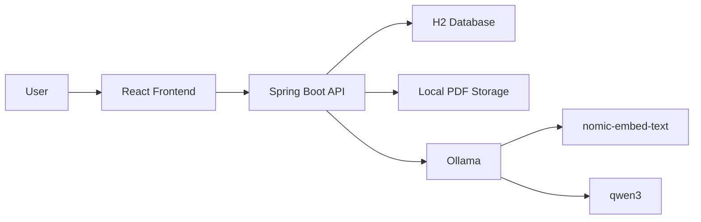

# PDF Assistant

A local PDF question-answering application built with Spring Boot, React, H2, PDFBox, and Ollama.

The app lets you upload a PDF, indexes its content using embeddings, and answers questions using Retrieval Augmented Generation (RAG). It runs with free local AI models through Ollama, so no paid API key is required.

## Features

- Upload PDF documents.
- Extract PDF text with Apache PDFBox.
- Split extracted text into searchable chunks.
- Generate embeddings locally with Ollama.
- Store document metadata, chunks, embeddings, and chat history in H2.
- Ask questions against a selected PDF.
- Generate grounded answers with page references.
- Show source snippets only when requested.
- React frontend with upload, document list, chat, loading overlay, and source toggle.

## Tech Stack

| Layer | Technology |
| --- | --- |
| Frontend | React, TypeScript, Vite |
| Backend | Spring Boot, Spring Web, Spring Data JPA |
| Database | H2 file database |
| PDF parsing | Apache PDFBox |
| AI runtime | Ollama |
| Chat model | `qwen3:8b` by default |
| Embedding model | `nomic-embed-text` |
| Build tools | Maven Wrapper, npm |

## Architecture



## How RAG Works Here

1. A PDF is uploaded from the frontend.
2. The backend stores the original PDF under `backend/data/uploads`.
3. PDFBox extracts text page by page.
4. Text is split into smaller chunks.
5. Each chunk is converted into an embedding vector by Ollama.
6. Chunks and embeddings are stored in H2.
7. When the user asks a question, the backend embeds the question.
8. The backend compares the question vector with stored chunk vectors.
9. The most relevant chunks are sent to the chat model.
10. The model answers using only the retrieved PDF context.

## Prerequisites

Install these before running the app:

- Java 17 or later
- Git
- Node.js and npm
- Ollama

Docker is not required.

## Ollama Setup

Install Ollama, then pull the required models:

```powershell
ollama pull qwen3:8b
ollama pull nomic-embed-text
```

If your machine is slow with `qwen3:8b`, use the smaller model:

```powershell
ollama pull qwen3:4b
```

Then update:

```properties
app.ollama.chat-model=qwen3:4b
```

in:

```text
backend/src/main/resources/application.properties
```

Verify Ollama is running:

```powershell
ollama list
```

## Project Structure

```text
pdf-assistant/
  backend/
    src/main/java/com/pdfassistant/backend/
      config/
      controller/
      domain/
      dto/
      repository/
      service/
    src/main/resources/application.properties
    src/test/resources/application.properties
    pom.xml
    mvnw.cmd
  frontend/
    src/
      App.tsx
      api.ts
      main.tsx
      styles.css
      types.ts
    package.json
    vite.config.ts
  .gitignore
  .npmrc
  README.md
```

Runtime files are created locally and are ignored by Git:

```text
backend/data/
backend/logs/
frontend/node_modules/
frontend/dist/
.m2/
.npm-cache/
```

## Configuration

Main backend config:

```text
backend/src/main/resources/application.properties
```

Important values:

```properties
server.port=8080
spring.datasource.url=jdbc:h2:file:./data/h2/pdf-rag;DB_CLOSE_DELAY=-1
app.storage.upload-dir=./data/uploads
app.ollama.base-url=http://localhost:11434
app.ollama.chat-model=qwen3:8b
app.ollama.embedding-model=nomic-embed-text
app.rag.chunk-size=2200
app.rag.chunk-overlap=250
app.rag.max-results=5
```

## Run Locally

Open two terminals.

### Terminal 1: Backend

```powershell
cd C:\Users\Sagarnil\proj\backend
$env:MAVEN_USER_HOME='C:\Users\Sagarnil\proj\.m2'
.\mvnw.cmd spring-boot:run
```

Backend runs at:

```text
http://localhost:8080
```

Health check:

```text
http://localhost:8080/api/health
```

### Terminal 2: Frontend

```powershell
cd C:\Users\Sagarnil\proj\frontend
$env:npm_config_cache='C:\Users\Sagarnil\proj\.npm-cache'
npm.cmd run dev
```

Frontend runs at:

```text
http://localhost:5173
```

## H2 Console

Open:

```text
http://localhost:8080/h2-console
```

Use:

```text
JDBC URL: jdbc:h2:file:./data/h2/pdf-rag
User: sa
Password:
```

Leave password blank.

## API Endpoints

| Method | Endpoint | Description |
| --- | --- | --- |
| `GET` | `/api/health` | Backend health check |
| `GET` | `/api/documents` | List uploaded documents |
| `POST` | `/api/documents` | Upload a PDF |
| `GET` | `/api/documents/{documentId}` | Get document details |
| `GET` | `/api/documents/{documentId}/messages` | Get chat messages for a document |
| `POST` | `/api/documents/{documentId}/questions` | Ask a question about a document |

Example question request:

```json
{
  "question": "Summarize this PDF"
}
```

## Build And Test

### Backend Tests

```powershell
cd C:\Users\Sagarnil\proj\backend
$env:MAVEN_USER_HOME='C:\Users\Sagarnil\proj\.m2'
.\mvnw.cmd test
```

Tests use an in-memory H2 database from:

```text
backend/src/test/resources/application.properties
```

### Frontend Build

```powershell
cd C:\Users\Sagarnil\proj\frontend
$env:npm_config_cache='C:\Users\Sagarnil\proj\.npm-cache'
npm.cmd run build
```

## Git Setup

Initialize and push:

```powershell
cd C:\Users\Sagarnil\proj
git init
git add .
git commit -m "Initial PDF assistant app"
git branch -M main
git remote add origin https://github.com/YOUR_USERNAME/pdf-assistant.git
git push -u origin main
```

If `origin` already exists:

```powershell
git remote set-url origin https://github.com/YOUR_USERNAME/pdf-assistant.git
git push -u origin main
```

If GitHub already has a README or license:

```powershell
git pull --rebase origin main
git push -u origin main
```

## Deployment Notes

This app needs a real server because it runs:

- Spring Boot
- H2 file storage
- Ollama
- Local AI models

GitHub Pages can host only the frontend static files. GitHub Actions can build and deploy the app, but it cannot permanently run the backend or Ollama.

Recommended free hosting path:

```text
GitHub repo -> GitHub Actions -> Oracle Cloud Always Free VM
```

On the VM:

- Nginx serves the frontend.
- Nginx proxies `/api/*` to Spring Boot.
- Spring Boot runs as a systemd service.
- Ollama runs locally on the same VM.
- Uploaded PDFs and the H2 database stay on VM disk.

## Troubleshooting

### npm is blocked in PowerShell

Use:

```powershell
npm.cmd -v
```

Or allow local scripts:

```powershell
Set-ExecutionPolicy -Scope CurrentUser -ExecutionPolicy RemoteSigned
```

### Ollama command not found

Close and reopen PowerShell after installing Ollama.

If needed, run it using the full path:

```powershell
& "$env:LOCALAPPDATA\Programs\Ollama\ollama.exe" list
```

### Backend cannot connect to Ollama

Check:

```powershell
ollama list
```

Also verify:

```text
http://localhost:11434
```

### H2 database is already in use

Only one running backend process can use the file database at a time. Stop old backend processes before starting another one.

### Scanned PDFs do not work

The current version extracts selectable text from PDFs. Scanned/image-only PDFs need OCR support, such as Tesseract, which is not implemented yet.

## License

This project is licensed under the terms in `LICENSE`.
