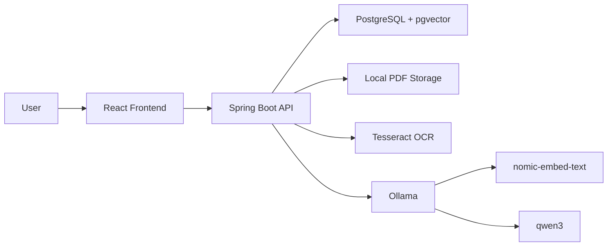

# PDF Assistant

A local PDF question-answering application built with Spring Boot, React, PostgreSQL + pgvector, PDFBox, Tesseract OCR, Docker, and Ollama.

The app lets you upload a PDF, indexes its content using embeddings, and answers questions using Retrieval Augmented Generation (RAG). It runs with free local AI models through Ollama, so no paid API key is required.

## Features

- Upload PDF documents.
- Extract selectable PDF text with Apache PDFBox.
- OCR scanned/image-only PDF pages with Tesseract.
- Split extracted text into searchable chunks.
- Generate embeddings locally with Ollama.
- Store document metadata, chunks, embeddings, and chat history in PostgreSQL with pgvector search.
- Ask questions against a selected PDF.
- Generate grounded answers with page references.
- Show source snippets only when requested.
- React frontend with upload, document-list, chat, loading overlay, and source toggle.

## Tech Stack

| Layer | Technology |
| --- | --- |
| Frontend | React, TypeScript, Vite |
| Backend | Spring Boot, Spring Web, Spring Data JPA |
| Database | PostgreSQL with pgvector |
| PDF parsing | Apache PDFBox |
| OCR | Tesseract |
| AI runtime | Ollama |
| Chat model | `qwen3:8b` by default |
| Embedding model | `nomic-embed-text` |
| Build tools | Maven Wrapper, npm |

## Architecture



## How RAG Works Here

1. A PDF is uploaded from the frontend.
2. The backend stores the original PDF under `backend/data/uploads`.
3. PDFBox extracts text page by page.
4. Pages with too little selectable text are rendered and OCR'd with Tesseract.
5. Text is split into smaller chunks.
6. Each chunk is converted into an embedding vector by Ollama.
7. Chunks and embeddings are stored in PostgreSQL.
8. When the user asks a question, the backend embeds the question.
9. PostgreSQL ranks stored chunks using pgvector cosine distance.
10. The most relevant chunks are sent to the chat model.
11. The model answers using only the retrieved PDF context.

## Prerequisites

Install these before running the app:

- Git
- Docker Desktop, recommended for the app stack
- Ollama
- Tesseract, only for non-Docker backend development with scanned PDFs
- Java 17 or later, only for non-Docker backend development
- Node.js and npm, only for non-Docker frontend development

Docker is the recommended way to run the app stack. The backend image installs Tesseract automatically. Ollama still runs on the host by default so it can use your local model cache and hardware acceleration.

## Ollama Setup

Install Ollama, then pull the required models:

```powershell
ollama pull qwen3:8b
ollama pull nomic-embed-text
```

If your machine is slow with `qwen3:8b`, use the smaller model:

```powershell
ollama pull qwen3:4b
```

Then update:

```properties
app.ollama.chat-model=qwen3:4b
```

in:

```text
backend/src/main/resources/application.properties
```

Verify Ollama is running:

```powershell
ollama list
```

## Project Structure

```text
pdf-assistant/
  backend/
    src/main/java/com/pdfassistant/backend/
      config/
      controller/
      domain/
      dto/
      repository/
      service/
    src/main/resources/application.properties
    src/test/resources/application.properties
    pom.xml
    mvnw.cmd
  frontend/
    src/
      App.tsx
      api.ts
      main.tsx
      styles.css
      types.ts
    package.json
    vite.config.ts
  .gitignore
  .npmrc
  README.md
```

Runtime files are created locally and are ignored by Git:

```text
backend/data/
backend/logs/
frontend/node_modules/
frontend/dist/
.m2/
.npm-cache/
```

## Configuration

Main backend config:

```text
backend/src/main/resources/application.properties
```

Important values:

```properties
server.port=8080
spring.datasource.url=${SPRING_DATASOURCE_URL:jdbc:postgresql://localhost:5432/pdf_assistant}
app.storage.upload-dir=${APP_STORAGE_UPLOAD_DIR:./data/uploads}
app.ollama.base-url=${APP_OLLAMA_BASE_URL:http://localhost:11434}
app.ollama.chat-model=qwen3:8b
app.ollama.embedding-model=nomic-embed-text
app.rag.chunk-size=2200
app.rag.chunk-overlap=250
app.rag.max-results=5
app.rag.embedding-dimensions=768
app.ocr.enabled=true
app.ocr.tesseract-command=tesseract
app.ocr.language=eng
app.ocr.dpi=300
app.ocr.page-segmentation-mode=6
app.ocr.min-text-characters-per-page=40
app.ocr.timeout-seconds=60
```

## Run Locally

### Docker Compose

Start Ollama on your host machine first, then run:

```powershell
docker compose up --build
```

The app runs at:

```text
http://localhost:5173
```

Backend API:

```text
http://localhost:8080
```

The compose stack starts:

- PostgreSQL with pgvector
- Spring Boot backend
- Tesseract OCR inside the backend container
- Nginx-served React frontend

Persistent runtime data is stored in Docker volumes:

```text
postgres_data
backend_uploads
```

By default, the backend reaches host Ollama at:

```text
http://host.docker.internal:11434
```

If you run without Docker, start PostgreSQL with pgvector first and set `SPRING_DATASOURCE_URL`, `SPRING_DATASOURCE_USERNAME`, and `SPRING_DATASOURCE_PASSWORD`. Install Tesseract and make sure the `tesseract` command is on your `PATH` if you want scanned PDF support.

### Manual Development

Open two terminals after PostgreSQL and Ollama are running.

### Terminal 1: Backend

```powershell
cd C:\Users\Sagarnil\proj\backend
$env:MAVEN_USER_HOME='C:\Users\Sagarnil\proj\.m2'
$env:SPRING_DATASOURCE_URL='jdbc:postgresql://localhost:5432/pdf_assistant'
$env:SPRING_DATASOURCE_USERNAME='pdf_assistant'
$env:SPRING_DATASOURCE_PASSWORD='pdf_assistant'
.\mvnw.cmd spring-boot:run
```

Backend runs at:

```text
http://localhost:8080
```

Health check:

```text
http://localhost:8080/api/health
```

### Terminal 2: Frontend

```powershell
cd C:\Users\Sagarnil\proj\frontend
$env:npm_config_cache='C:\Users\Sagarnil\proj\.npm-cache'
npm.cmd run dev
```

Frontend runs at:

```text
http://localhost:5173
```

## Database

The application uses Flyway migrations from:

```text
backend/src/main/resources/db/migration
```

The initial migration enables pgvector and creates:

```text
pdf_documents
document_chunks
chat_messages
```

`document_chunks.embedding` is a `vector(768)` column, matching the default `nomic-embed-text` embedding size. If you change embedding models, also update `APP_RAG_EMBEDDING_DIMENSIONS` and the database schema.

## API Endpoints

| Method | Endpoint | Description |
| --- | --- | --- |
| `GET` | `/api/health` | Backend health-check |
| `GET` | `/api/documents` | List uploaded documents |
| `POST` | `/api/documents` | Upload a PDF |
| `GET` | `/api/documents/{documentId}` | Get document details |
| `GET` | `/api/documents/{documentId}/messages` | Get chat messages for a document |
| `POST` | `/api/documents/{documentId}/questions` | Ask a question about a document |

Example question request:

```json
{
  "question": "Summarize this PDF"
}
```

## Build And Test

### Backend Tests

```powershell
cd C:\Users\Sagarnil\proj\backend
$env:MAVEN_USER_HOME='C:\Users\Sagarnil\proj\.m2'
.\mvnw.cmd test
```

Tests use an in-memory database from:

```text
backend/src/test/resources/application.properties
```

### Frontend Build

```powershell
cd C:\Users\Sagarnil\proj\frontend
$env:npm_config_cache='C:\Users\Sagarnil\proj\.npm-cache'
npm.cmd run build
```

## Git Setup

Initialize and push:

```powershell
cd C:\Users\Sagarnil\proj
git init
git add .
git commit -m "Initial PDF assistant app"
git branch -M main
git remote add origin https://github.com/YOUR_USERNAME/pdf-assistant.git
git push -u origin main
```

If `origin` already exists:

```powershell
git remote set-url origin https://github.com/YOUR_USERNAME/pdf-assistant.git
git push -u origin main
```

If GitHub already has a README or license:

```powershell
git pull --rebase origin main
git push -u origin main
```

## Deployment Notes

This app needs a real server because it runs:

- Spring Boot
- PostgreSQL with pgvector
- Ollama
- Local AI models

GitHub Pages can host only the frontend static files. GitHub Actions can build and deploy the app, but it cannot permanently run the backend or Ollama.

Recommended free hosting path:

```text
GitHub repo -> GitHub Actions -> Oracle Cloud Always Free VM
```

On the VM:

- Nginx serves the frontend.
- Nginx proxies `/api/*` to Spring Boot.
- Spring Boot runs as a systemd service.
- PostgreSQL with pgvector stores metadata, chunks, embeddings, and chat history.
- Ollama runs locally on the same VM.
- Uploaded PDFs and database volumes stay on VM disk.

## Troubleshooting

### npm is blocked in PowerShell

Use:

```powershell
npm.cmd -v
```

Or allow local scripts:

```powershell
Set-ExecutionPolicy -Scope CurrentUser -ExecutionPolicy RemoteSigned
```

### Ollama command not found

Close and reopen PowerShell after installing Ollama.

If needed, run it using the full path:

```powershell
& "$env:LOCALAPPDATA\Programs\Ollama\ollama.exe" list
```

### Backend cannot connect to Ollama

Check:

```powershell
ollama list
```

Also verify:

```text
http://localhost:11434
```

### PostgreSQL port is already in use

If port `5432` is busy, change `POSTGRES_PORT` in `.env` or stop the other PostgreSQL process.

### Scanned PDFs are slow or fail

OCR is slower than selectable-text extraction because every sparse page is rendered as an image and processed by Tesseract.

With Docker, rebuild the backend image so Tesseract is installed:

```powershell
docker compose up --build
```

For manual backend runs, verify Tesseract is available:

```powershell
tesseract --version
```

If OCR is too slow, lower `APP_OCR_DPI`, lower `APP_OCR_MIN_TEXT_CHARACTERS_PER_PAGE`, or disable OCR with:

```properties
APP_OCR_ENABLED=false
```

## License

This project is licensed under the terms in `LICENSE`.
